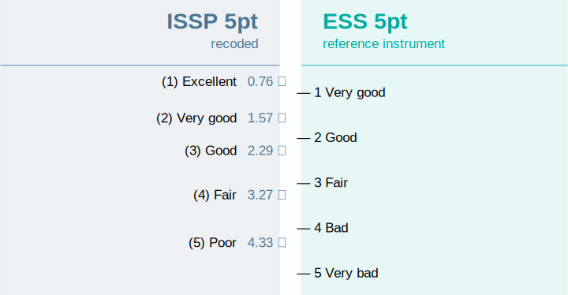
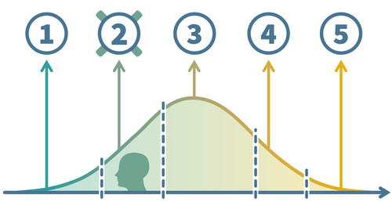
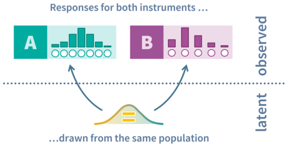
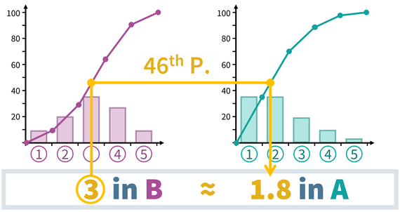
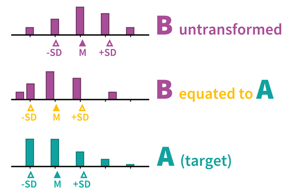
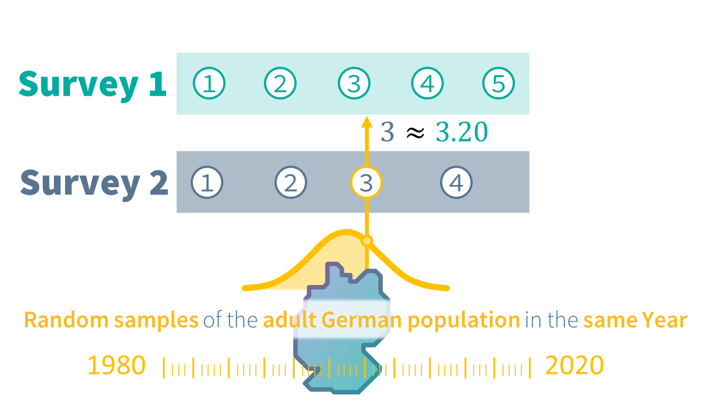
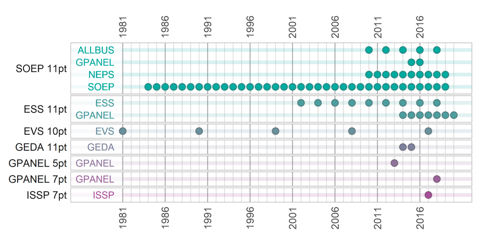
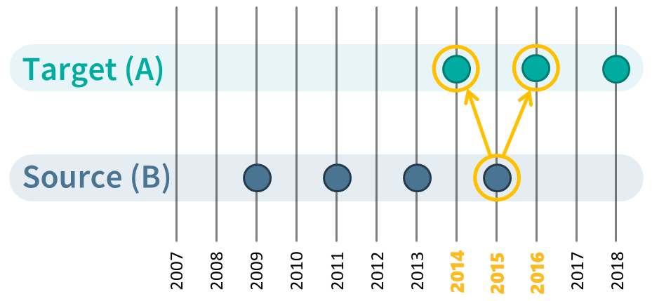
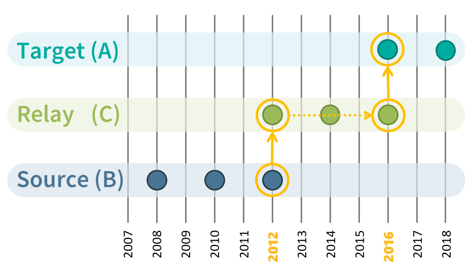
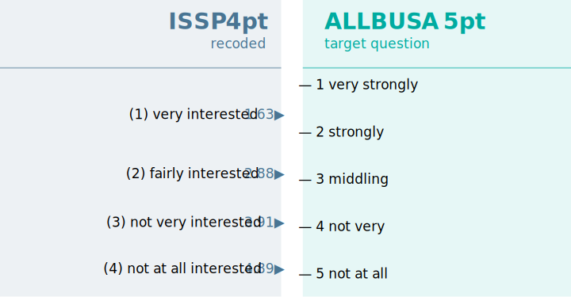

# 00 Motivation and methodological background

The QuestionLink R-package aims to help researchers who want to harmonize survey data on a concept that were gathered with different questions. Specifically, the focus lies on (single) survey questions used to capture a latent construct, such as attitudes, values, interests, or subjective evaluations.

Consider two different questions on respondents' subjective evaluation of their general health:

> **European Social Survey (ESS)**
>
> How is your health in general? Would you say it is...
>
> Very good / Good / Fair / Bad / Very bad

> **International Social Survey Programme (ISSP)**
>
> In general, would you say your health is...
>
> Excellent / Very good / Good / Fair / Poor

How would you compare (or even combine) responses to these two questions?

Such problems are the purview of ex-post harmonization, a methodological field that seeks to assess and improve the comparability of data that have already been collected. Such harmonization can be challenging, but increasing comparability and combining (survey) data across different data sources opens up [many new opportunities for research](https://blog.gesis.org/the-sum-and-its-parts-the-benefits-of-combining-data-from-different-surveys/). In what follows, we will give a brief overview of the challenges this entails to motivate the QuestionLink R package.

## Harmononizing (single-item) survey questions for latent constructs

Harmonizing data measured with different questions across different surveys is not easy. For example, before we can even think of combining data across different questions, we need to ensure that [different questions actually measure the same concept](https://blog.gesis.org/apples-and-oranges-how-to-find-out-if-two-questions-measure-the-same-concept/). However, even if they do, we often need to align their measurement units. In other words, before comparing or combining data across questions, we need to ensure that their numerical response scores imply the same level of the measured construct.

Consider again the example about general health. Now imagine a respondent who chose the third response option ("good") in the ISSP question. What response would they have chosen in the ESS question? Also the third response option? But that would be "fair" in the ESS. Or perhaps they would have also chosen "good" in the ESS; thus choosing the second instead of the third response option. In any case, we cannot be certain. And as it turns out, the empirical reality is more complicated than just matching the same response options via recoding. Instead, at least for the ESS and ISSP waves in Germany, [QuestionLink derived the following harmonization solution](https://www.gesis.org/en/services/processing-and-analyzing-data/data-harmonization/question-link/general-health) from ISSP to ESS:



As it turns out, matching a "3" in the ISSP question with a "3" in the ESS question would be inadequate. That seems plausible, since "good" and "fair" are rather different response labels. But matching "good" and "good" across ISSP and ESS also does not work perfectly. After all, respondents take the whole response scale into account when answering a question.

### Harmonizing measurement units

However, how did we derive these values and how are they justified? To understand what is happening here, we have to take a step back and look at the difference between (observed) response scores and (latent) construct expressions.

If we have a single question measuring a latent construct (such as general health), we have to keep in mind that the construct itself does not have natural categories or levels. Instead, the latent construct in respondents' minds are amorphous ideas that can be best understood as a continuous value. When respondents then answer a question about that construct, they recall (or infer) their approximate position on that latent, continuous dimension. However, they cannot express this position directly in a survey. Instead, they have to choose a response option they feel best represents that position. And those response options are not continuous, they are discrete and (only) ordinal. In other words, observed response scores are the product of respondents mapping a continous latent construct value onto a discrete, ordinal response scheme.

Visually, we might imagine our sample of respondents to have a continuous distribution of "true" latent construct values. Depending on their value, i.e., their position on the continuum, they choose a response option. This implies that response options "cut" the distribution of latent scores into ordinal response scores. (This simplified view ignores random response error. For a more realistic model, consider IRT models or differential item functioning methods in general.)



In practice, social scientists often ignore this detail, because we can often treat the ordinal observed response scores as pseudo-metric. However, when we harmonize two different questions for the same construct, the issue becomes pressing. That is because different questions (different wording, different response scales etc.) project latent scores differently onto observed scores. They "cut" the latent continuum into ordinal scores with different thresholds; both thresholds in different positions or even a different number of thresholds when the number of response options differs. For a bit more on this issue, we recommend reading this [blog post](https://blog.gesis.org/ceci-nest-pas-une-pipe-disentangling-measurement-and-reality-in-ex-post-harmonization/).

How then can we bridge these differences between two (or more) questions for the same construct? Commonly considered approaches are linear stretching and z-standardization. Both are insufficient in most cases, as you will discover yourself in the section on [insufficient alternatives](#sec-insufficient-alternatives).

### Observed score equating in a random groups design (OSE-RG)

Instead of these alternatives, QuestionLink applies a method called ***observed score equating in a random groups design*** **(OSE-RG)**. In this context, we can only give you a basic intuition. If you are interested, we recommend these two sources to delve deeper into equating.

Kolen and Brennan cover equating in-depth in their book:

> Kolen, M. J., & Brennan, R. L. (2014). *Test Equating, Scaling, and Linking* (3rd ed.). Springer. <https://doi.org/10.1007/978-1-4939-0317-7>

However, equating was originally conceived to harmonize multi-item scales. For applying equating algorithms to harmonize two single survey questions, see:

> Singh, R. K. (2022). Harmonizing single-question instruments for latent constructs with equating using political interest as an example. *Survey Research Methods*, *16*(3), 353--369. <https://doi.org/10.18148/srm/2022.v16i3.7916>

However, we can quickly get an intuition of how OSE-RG works. At its core, OSE-RG tries to answer the question what a respondent with a certain observed score in one question would answer, on average, in another question on the same construct. As in our example above, what would a respondent who chose a "3 - good" in the ISSP choose in the ESS question on average? The result of OSE-RG then was: 2.29 on average. This "on average" both acknowledges the role or random response error as well as the fact that there is seldom an exact integer correspondence between response options of two questions (e.g., 3 = 4).

This still leaves the question, how we can get these **equivalent values**. A first idea might be to show respondents both questions and then compare their responses. In such a setup, we might then take respondents who choose a "1" on question A and average the responses they gave on question B to get the equivalent value. Then we repeat that process for scores 2, 3, and so on. This is, in fact, a practiced equating approach for multi-item scales called **single-group design**. However, for single questions in survey research, the approach is often not feasible. First, the procedure only works if respondents answeres to the questions are independent. Yet with only two questions, respondents will probably rememer their previous answer. This creates a bias that even a randomized order cannot solve completely. Second, we almost never have single-group data available in existing survey data sources and we might not be able to afford collecting single-group data on all questions in all combinations for our harmonization project.

So as the "RG" or OSE-RG already implies, we use another research design in QuestionLink: The **random groups** design. This approach is best understood when we imagine a split-half experiment, where one random half of respondents sees one question and the other half the other question. Now the important point is that due to the randomness of group assignment, we expect no systematic differences between the groups in terms of their actual construct values. In such an experiment, both groups have the same latent distribution of the relevant construct. They feel equally healthy on average, with the same standard deviation and so on. However, the distribution of measured values will be quite different, because each question maps this latent distribution differently onto observed response scores.

Visually, we might imagine the situation like this:


The continuous distributions in the middle are the "true" contruct distributions in both random groups. They mirror each other, because they are identical through the random groups design. However, we see that the two questions (above and below) have different thresholds. They map the latent scores differently onto observed response scores. This means, for example, that a person with a specific general health (yellow point), would choose different responses in the two questions.

The result on an aggregate level is that we get two different observed response distributions (think: frequency tables) for the two questions, even though they measure the same latent distribution. Responses to both questions are, after all, randomly drawn from the same population:



What OSE-RG now does is to simply transform scores of one question so that its observed response distribution aligns with the shape of the other question's observed response distribution. That sounds very abstract, but is actually really intuitive. Imagine we want to harmonize two questions and we know that the underlying population (and thus the latent distribution) are the same. How should the average responses to the two questions be, after successful harmonization? Identical, of course. After all, both random groups have the same true mean construct score (e.g., the same mean general health). Similarly, we would expect the same standard deviation, the same skewness, and the same kurtosis.

If we feed data into an OSE-RG algorithm, we get, in essence, a recording table with which we can harmonize one question to the format of the other. If we apply it, we get just what we want: The same response distribution shape in the random groups setting, regardless of the question. There are different algorithms to achieve that. The simplest is linear equating, which assumes normally distributed responses and only harmonizes the mean and standard deviation. However, since response distributions are often skewed, we instead use equipercentile equating, which is more flexible and also harmonizes differences in skewness and kurtosis. You can learn more about these algorithms in two blog posts on [linear equating](https://blog.gesis.org/the-new-normal-linear-equating-of-different-instruments/) and [equipercentile equating](https://blog.gesis.org/cats-are-liquids-equipercentile-equating-of-different-instruments/).

However, in a nutshell, equipercentile equating looks at the cumulative relative frequencies of both questions in the random groups data (i.e., 10% chose response 1, 25% chose response 2 or less, 37% chose response 3 or less and so on). The algorithm then transforms all responses of one question (B) into their percentiles. And then those percentiles are transformed back into (continuous approximations) of responses in the other question (A).



The result after harmonization then looks like this:



The result of this recoding of responses to B is that the distribution shape (e.g., mean and standard deviation) now align between A and B. Now it is important no note that this does not only harmonize the current random groups data. Instead, once such a recoding table has been derived from the random groups data, we can use it to harmonize the two questions in many other data sets as well. The only assumption that we need is that the two questions work the same in those other samples as well (see the section on [Population invariance](https://matroth.github.io/questionlink/articles/advanced_use_cases#population-invariance)).

### Finding random groups data

The only remaining issue is that we usually cannot perform methodological split-half experiments for all the many questions we might want to harmonize for a project. However, when we harmonize data from survey programs we might find that we already have random groups data, at least for some of the questions for a construct that we want to harmonize. Specifically, we are looking for instances were two questions were used in random samples of the same population at the same time.

For example, imagine two survey programs which randomly sample the adult German population along overlapping time series. Then we could take samples of both surveys (with their respective questions for our construct) from the same year and use that for our equating.



This approach has the advantage that we can reuse existing data. Data that we most likely have researched and prepared for the harmonization project anyway. However, finding such links can be daunting if done manually. Consider the [QuestionLink example for general life satisfaction](https://www.gesis.org/en/services/processing-and-analyzing-data/data-harmonization/question-link/general-life-satisfaction) across several national and international survey programs with random samples of the adult German population:



The figure shows us all the different questions for general life satisfaction (in black to the right of the plot). Then in color, each row is one survey program that used the respective question. And then each dot represents a wave where that question was used in that survey program in a specific year. On the one hand, the figure makes us optimistic, that finding opportunities for equating across survey programs is quite realistic, at least for more common constructs.

On the other hand, we still face some obstacles. First, there are some questions that we cannot harmonize directly, because they do not share a year in which they were used. Consider, for example, the questions "EVS 10pt" and "GPANEL 5pt". Second, we would also like to use all possible opportunities for equating (i.e., connection) instead of just using one possible connection. This is because equating, like all empirical methods, comes with random error (for example due to the randomness of the sampling process). Combining several equatings makes them more robust.

Fortunately, the QuestionLink R-Package helps solves all these issues automatically. To understand how that works, we need to consider the three types of connections that provide opportunities for equating. And we need to understand how to aggregate the results of different connections.

### Types of connections

QuestionLink finds three types of connections: Direct, time-relaxed, and relay connections. The first type, **direct connections**, is the case we have already discussed: Using data where two questions were used in (random samples of) the same populations in the same year:


However, sometimes we can only find instances where two questions were used in almost the same year, but not a direct connection. We call that **time-relaxed connections**, because to use them we need to relax the constraints we put on time overlap. The QuestionLink R-package allows you to choose just how much difference in years you want to allow. Often, one year can be enough. For example, when one survey covers even years and the other survey covers odd years. Time-relaxation is, of course, easier to justify with constructs that are relatively stable over time than with those that fluctuate year by year. However, please consider that QuestionLink uses all possible connections at one. This often means we have counterbalancing time-relaxed connections (i.e., harmonizing one year earlier and then harmonizing one year later):



The final and most powerful tool are **relay connections**. They become possible, because equating can be chained. Imagine a situation with three questions, A, B, and C. We happen to have random groups data for A-C and for B-C. However, our goal is to harmonize A to C. Fortunately, we can achieve this easily by equating A to C, and then equating the values of A in the format of C to B. In other words, we harmonize A to B via the relay C. The only downside to such relay connections is, that they incur random errors twice during equating. However, we can usually find many of such relay connections and by aggregating them we can mitigate this issue.



With these three types of connections, our chances to be able to harmonize the questions for a construct we are interested in have risen dramatically. At the same time, if we find and apply all these connections we are left with many equating solutions (\~ recoding tables) for each question pair (and in both directions; e.g., A-\>B & B-\>A). And most likely, these solutions will fluctuate due to random sampling errors. What QuestionLink now does is to aggregate all harmonization solutions (one for each connection between two questions in one direction) into a single, robust harmonization solution.

After finding all possible connections and performing equatings for each connection, QuestionLink then **summarizes all possible solutions** for a question pair (in one direction) into a single recoding table. This is done be calculating the median equivalent value for each score of the question we want to harmonize. The result is that random errors are mitigated to a large extent. This might seem abstract, but we demonstrate this in the article of advanced use cases in the section [retrieving recoding tables](https://matroth.github.io/questionlink/articles/advanced_use_cases#retrieving-recoding-tables).

# 01 Setting up a simulated population

Our goal in this section and the next is to simulate survey responses on different measurement instruments that measure the same construct. To do so, we fist simulate the underlying "true" development of that construct in our simulated population over time. Usually, we think of true construct scores as continuous, one-dimensional values. There are no natural steps or categories in constructs such as political interest, life satisfaction, or intelligence. Instead we imagine them to be seamless, gradual values along a dimension.

Our setup here is to create a data frame which will contain 2000 simulated construct values per year for every year from 1980 to 2020.

The code works as follows step-by-step:

1.  We create the data frame (or tibble in the tidyverse) and populate it with a year variable with values from 1980 to 2020. For now, the data frame has 40 rows (one for each year).
2.  We add a variable `target_construct_mean` which represents the idealized trend over time that we want our simulated construct to follow. The formula does nothing else than create a mean value from `-0.5` to `0.5`. Over the forty years, the mean will gradually (and linearly) increase.
3.  Now we simulate for each year a sample of 2000 true scores. This simulation assumes a normal distribution of true scores around our target mean (`target_construct_mean`) for each year with a standard distribution of 1. We "nest" a vector containing all 2000 scores in each cell in the variable `simulated_true_score`. Currently, the data frame still only has 40 rows, but in each cell in the last variable we have crammed 2000 values.
4.  In the last step, we use `unnest()` to arrive at a tidier data frame. What unnest does is to unfold the score vectors in `simulated_true_score` so that each row only contains one value. In other words, we now unfold our data frame of 40 rows (each row a year) into a data frame of 40 \* 2000 = 80000 rows (each row a true construct value).

With the `sample_n()` function, we look at 10 randomly selected rows from the 80000 rows of the simulated data frame. We see that each row has a specific `year`, a target construct mean `target_construct_mean` and a specific simulated value `simulated_true_score`.

```{r}

library(dplyr)
library(patchwork)
library(tibble)
library(tidyr)
library(purrr)
library(kableExtra)
library(patchwork)
library(viridis)
library(ggplot2)
library(forcats)

## Installing questionlink with devtools
#devtools::install_github("https://github.com/MatRoth/questionlink")
## Installing questionlink with pak
##install.packages("pak")
#pak::pak("https://github.com/MatRoth/questionlink")

library(questionlink)

# Helpers

format_table <- function(df){
  df |> kable() |> 
    kable_styling(position = "left",
      full_width = FALSE
      )
}

```

```{r}
#| code-fold: show

survey_sample_n = 2000

sim_df <- tibble(
  year = c(1980:2020),
  # construct linearly increases over time
  target_construct_mean = ((year - min(year))/ (max(year)-min(year)))-0.5, 
  simulated_true_score = map(target_construct_mean, ~ rnorm(survey_sample_n, .x, 1))
) |> unnest(simulated_true_score)

sim_df |> sample_n(10) |> format_table()
  
```

### Simulated change over time

Now we can plot these mean of these continuous construct scores over time. We see that the "true" average construct score for our simulated population slowly shifts by one standard deviation over the course of 40 years. In substantive terms, imagine the average of an opinion slowly, and steadily increasing, year after year.

```{r}

sim_df |> 
  ggplot(aes(year, simulated_true_score))+
  geom_smooth(se = FALSE)+
  theme_minimal()+
  scale_y_continuous(breaks = c(-0.5, -0.25, 0, 0.25, 0.5),
                     minor_breaks = NULL)
```

### Normally distributed simulated scores per year

However, the mean values for each year hide that we actually have a (normal) distribution of construct scores for each year. In other words, there is a spread of lower, medium, and higher construct scores in each year. Below, we see these simulated "true" construct score distributions for different years. For better visibility, only full decades are shown. Observe how the distribution slowly wanders to the right, as the average value increases over time.

*(For those unfamiliar with these type of plots: This is a density plot. It shows for construct values on the x-axis how frequent they are in the data (or how probable each value is, actually). The y-axis values do not have meaningful values. They are simply chosen by R so that the area under the curve is one, so that the probability of the whole curve is one, since it represents all values. As an intuition, think of density plots as histograms for continuous data.)*

```{r}

sim_df |> 
  filter(year %% 10 == 0) |> #only select full decades
  ggplot(aes(simulated_true_score, color = year |> as.factor()))+
  geom_density()+
  scale_color_viridis(discrete = TRUE, end = 0.8)+ # coloring
  theme_minimal()

```

# 02 Simulating survey responses

Now that we have simulated the continuous construct values, we need to derive simulated response values. After all, survey respondents do not give decimal values as their answer. Instead, they choose one of several discrete, ordinal response options, such as "somewhat agree".

To simulate this, we will transform the continuous, simulated scores into discrete, integer response scores. This is done by "cutting" the continuous scores into discrete responses at certain thresholds, using our `cut_responses()` helper function. (Please note that this is an very simplistic view on actual response processes, but it serves our needs here just fine.)

```{r}

# helper function that allows us to cut continuous values into ordinal chunks
cut_responses <- function(x, breaks){
  ord_vec <- cut(x, c(-Inf, breaks, Inf), labels = FALSE)
  return(ord_vec)
}

```

For example: Calculating simulated responses for the year 2000. Below we see the density plot for the continuous construct values we have simulated for the population in the year 2000. The vertical lines over the density plot represent the thresholds with which we will cut this continuous construct into ordinal responses. Values up to the first (leftmost) threshold will become the response score "1", then between the first and second threshold, a response score of "2" and so on.

```{r}

cutting_example <- sim_df |> 
filter(year == 2000) |> 
  mutate(
    example_response = cut_responses(
      simulated_true_score,
      c(-1.5, -0.3, 0.5, 2)
    )
  ) 

cutting_example |> 
  ggplot()+
  geom_density(aes(simulated_true_score))+
  geom_vline(xintercept = c(-1.5, -0.5, 0.5, 1.5))+
  theme_minimal()


```

Below we see the resulting simulated response distribution. The barchart shows the relative frequency of the five possible response options.

```{r}

cutting_example |> 
  count(example_response) |> 
  mutate(`relative frequency (%)` = 100 * n / sum(n)) |> 
  ggplot(aes(example_response, `relative frequency (%)`))+
  geom_bar(stat = "identity")+
  theme_minimal()+
  ggtitle("Example for a simulated response distribution")

```

### Defining four question versions

Now we apply this process to simulate different questions. That means questions which all capture the same concept, but with different question wording, or different response scales. Such differences mean that the same continuous true score distribution is cut into different observed response distributions, because [the thresholds differ](https://blog.gesis.org/not-by-any-stretch-of-the-imagination-a-cautionary-tale-about-linear-stretching/).

Specifically, we will simulate four different questions (A, B, C, and D), which all capture our simulated construct. Questions A, B, and C are all 5-point response scales. Questions B and C are based on the thresholds of question A, but they are additively shifted (different mean response) and multiplicatively stretched (different standard deviation). Question D, meanwhile, is a 10-point instrument, to demonstrate that QuestionLink can handle different numbers of response options with ease.

```{r}


response_thresholds_A <- c(-1.5, -0.5, 0.5, 1.5)
response_thresholds_B <- (response_thresholds_A - 0.5) * 1.5
response_thresholds_C <- (response_thresholds_A + 0.5) * 0.7
response_thresholds_D <- seq(-1, 2, length.out = 9)

sim_df <- sim_df |> 
  mutate(
    question_A = cut_responses(simulated_true_score, response_thresholds_A),
    question_B = cut_responses(simulated_true_score, response_thresholds_B),
    question_C = cut_responses(simulated_true_score, response_thresholds_C),
    question_D = cut_responses(simulated_true_score, response_thresholds_D)
  )

sim_df |> 
  head() |> 
  format_table()


```

### Preparing long format for QuestionLink

Currently, the four questions are represented in a wide format data frame. This means we have four variables, one for each question. This also means we have four responses in every row. However, QuestionLink expects data in long-format. That means each row in the dataframe represents a single `response`. Each response has an associated `year` (in which the response was collected) and a `question` (which represents the different measurement instruments). Transforming data from wide to long format is easily done with `tidyr::pivot_longer()`. Below you see the first six rows in the new, long format data frame:

```{r}

qlink_format_df <-   sim_df |> 
  select(year, contains("question")) |> 
  pivot_longer(contains("question"), values_to = "response") |> 
  separate(name, into = c("discard", "question")) |> 
  select(-discard)

qlink_format_df |> head() |> format_table()

```

#### Overview of response distributions

Here we see the simulated response distributions across all four question variants and across the years. Note that the plot only shows the full decades 1980, 1990, 2000, 2010, and 2020.

```{r}

qlink_format_df |> 
  filter(year %% 10 == 0) |> 
  count(year, question, response) |> 
  group_by(year, question) |> 
  mutate(
    response = factor(response),
    relative_frequency = 100 * n / sum(n) # Calculates relative response frequencies
  ) |> 
  ggplot(aes(response, relative_frequency))+
  facet_grid(
    rows = vars(year),
    cols = vars(question),
    scales = "free_x"
  )+
  geom_bar(stat = "identity")+
  theme_minimal(base_size = 16)+
  theme(
    panel.grid.major.x = element_blank()
  )


```

### Creating artificial "gaps" in the timeseries

One of the main advantages of QuestionLink is that it helps find opportunities for harmonization across many different question variants, surveys and their respective waves. To showcase this, we create gaps in the time-series of our simulated question variants. This is a plausible situation, when different survey programs begin or end their time series at different intervals.

First, the current simulated data without gaps in the time-series:

```{r}

qlink_format_all_years_df <- qlink_format_df

plot_question_years <- function(combined_df){
  
  year_min = min(combined_df$year)
  year_max = max(combined_df$year)
  years_vec = c(year_min:year_max)
  major_breaks_vec = years_vec[years_vec %% 5 == 0]
  
  combined_df |> 
    group_by(year, question) |> 
    summarise() |> 
    ungroup() |> 
    arrange(question) |> 
    mutate(question = fct_rev(question)) |> 
    ggplot(aes(year, question, color = question))+
    geom_point(size = 3)+
    scale_x_continuous(breaks = major_breaks_vec,
                       minor_breaks = years_vec)+
    theme_minimal(base_size = 16)+
    theme(legend.position = "none")
}

qlink_format_df |> plot_question_years()


```

#### Showcasing the time-relaxation feature

The logic of OSE-RG, the method behind QuestionLink, dictates that we have to match data from different instruments gathered from the same "population". Here that would ideally mean data randomly sampled from the population (e.g., adult Germans) in the same year. However, sometimes surveys collect data in alternating years and the direct years cannot be easily matched. If a construct does not change dramatically from year to year, we can "relax" this constraint; for example to allow adjacent years. (For more information on time-relaxed connections, see the section on [types of connections].)

For this reason, we make it so that questions are only asked every two years. In even years for A, B and C, but in odd years for D!

```{r}

qlink_format_df <- qlink_format_df |> 
  filter(!(question == "A" & year %% 2 != 0)) |> 
  filter(!(question == "B" & year %% 2 != 0)) |> 
  filter(!(question == "C" & year %% 2 != 0)) |> 
  filter(!(question == "D" & year %% 2 == 0)) 

qlink_format_df |> 
  plot_question_years()

```

#### Showcasing the relay link feature

QuestionLink can also bridge larger gaps in joint time series, where two questions do not overlap in time at all. This becomes possible with relay links, where QuestionLink harmonizes one question to another relay question and then that onwards to the actual target question. In our example data, we will create a gap so that instruments A and B do no longer overlap. However, A and B both overlap with questions C and D. Hence we can form the relay links A -\> C -\> B and A -\> D -\> B. (For more information on relay connections, see the section on [types of connections].)

Thus we arrive at our final simulated survey wave structure. (For simplicity's sake, we assume that each question is used by one of four different surveys sampling the same population, but with different waves schedules.)

```{r}

# Defining gaps in time series by defining the "possible years" for each question

possible_years_lists <- list(
  A = c(2000:2015),
  B = c(1980:1990),
  C = c(1980:2020),
  D = c(1985:2005)
)

qlink_format_df <- qlink_format_df |> 
  mutate(
    valid_year = map2_lgl(year, question, ~ .x %in% possible_years_lists[[.y]])
  ) |> 
  filter(valid_year) |> 
  select(-valid_year)

qlink_format_df |> 
  plot_question_years()


```

# 03 Does QuestionLink work?

After putting in all this work to simulate different survey responses for the same construct, we want to harmonize them again. To show how easy this is with QuestionLink, let us harmonize our four simulated questions in one pass. Later, we will discuss each step and the respective options one by one. For now, note how we can complete the entire harmonization process in one pipe with four lines of code. As an example, we harmonize towards the format of question "A".

```{r}
harmonized_df <- qlink_format_df |>  
  ql_prepare(use_relay = TRUE, time_relaxation = 1) |> 
  ql_harmonize() |>  
  ql_transform(target = "A")
```

## Results of QuestionLink

Did it work? Let us find out by plotting the mean scores across the time-series: Once unharmonized and once harmonized with QuestionLink.

```{r}

unharmonized_mean_plot <- qlink_format_df |> 
  ggplot(aes(year))+
  geom_smooth(aes(y = response, color = question), se = FALSE, method = "lm")+
  scale_y_continuous(limits = c(1,10), breaks = c(1:10), minor_breaks = NULL)+
  theme_minimal()+
  ggtitle("unharmonized")

harmonized_mean_plot <- harmonized_df |> 
  ggplot(aes(year))+
  geom_smooth(aes(y = median_equivalent, color = question), se = FALSE, method = "lm")+
  scale_y_continuous(limits = c(1,10), breaks = c(1:10), minor_breaks = NULL)+
  theme_minimal()+
  ggtitle("QuestionLink harmonized")

# Combining both plots with patchwork::
unharmonized_mean_plot + harmonized_mean_plot

```

QuestionLink has harmonized both the differences in the mean and the differences in standard deviation. Hence, intercept and slope of our four time-series now align. Subtantively speaking, this means that in each year we can safely compare the average score across the four instruments. It also means that QuestionLink has harmonized the growth rate over time (i.e., the slope), by harmonizing the standard deviation of all four questions. Below, we veryify this by looking at the standard deviation directly:

```{r}

unharmonized_sd_plot <- qlink_format_df |> 
  group_by(year, question) |> 
  summarise(
    `standard deviation` = sd(response)
  ) |> 
  ggplot(aes(year, `standard deviation`, color = question))+
  geom_point()+
  theme_minimal()+
  ggtitle("unharmonized")+
  scale_y_continuous(limits = c(0,3), minor_breaks = NULL)+
  theme_minimal()

harmonized_sd_plot <- harmonized_df |> 
  group_by(year, question) |> 
  summarise(
    `standard deviation` = sd(median_equivalent)
  ) |> 
  ggplot(aes(year, `standard deviation`, color = question))+
  geom_point()+
  theme_minimal()+
  ggtitle("QuestionLink harmonized")+
  scale_y_continuous(limits = c(0,3), minor_breaks = NULL)+
  theme_minimal()

unharmonized_sd_plot + harmonized_sd_plot
  
```

## Insufficient alternatives {#sec-insufficient-alternatives}

While QuestionLink worked well, you might ask yourself if all this effort was worth it. To address these concerns, let us look at commonly considered alternatives.

### Z-standardization

First, let us look at z-standardization. The approach centers and scales variables so that their mean equals zero ($\bar{x}=0$) and their standard deviation equals one ($S=1$). The resulting scores are called $z$-scores.

The formula is quite simple:

$$
z=\frac{x-\bar{x}}{S}
$$

We center by subtracting the arithmetic mean of the scores from each score and the we scale by dividing by the standard deviation.

One complexity with z-standardization is that we can standardize the same data-set in different ways. As an example, we now z-standardize our simulated data-set in four ways:

1.  **Overall:** Here we standardize all responses across all four questions and all forty years in one go. This means we scale with the mean and sd of the entire vector of response scores regardless of question or year.
2.  **By question:** However, because we want to harmonize the differences between the four questions, we might instead z-standardize each question separately. This means scaling responses to each question by the mean and sd of each question separately.
3.  **By year:** Another common idea is to z-standardize year by year, regardless of the question. This means scaling responses by the mean and sd of all questions year by year.
4.  **By year and question combined:** Lastly, we might think that harmonization requires z-standardization over questions and years at the same time. This means scaling responses by the mean and sd of each question in each year separately.

::: callout-note
Note how in the code below, these distinctions are realized with the `dplyr::group_by()` function. That function modifies the following mutate statement so that the `scale()` function standardizes by the correct mean and sd.
:::

```{r}
z_example_df <- qlink_format_df |> 
  mutate(
    response_z_overall = scale(response)
  ) |> 
  group_by(question) |> 
  mutate(
    response_z_by_question = scale(response)
  ) |> 
  ungroup() |> 
  group_by(year) |> 
  mutate(
    response_z_by_year = scale(response)
  ) |> 
  group_by(year, question) |> 
  mutate(
    response_z_by_year_question = scale(response)
  )
```

```{r}
z_overall_plot <- z_example_df |> 
  ggplot(aes(year))+
  geom_smooth(aes(y = response_z_overall, color = question), se = FALSE, method = "lm")+
  #scale_y_continuous(limits = c(1,10), breaks = c(1:10), minor_breaks = NULL)+
  theme_minimal()+
  theme(legend.position = "none",
        axis.title.y = element_blank(),)+
  scale_y_continuous(limits = c(-4, 4))+
  ggtitle("overall")

z_by_question_plot <- z_example_df |> 
  ggplot(aes(year))+
  geom_smooth(aes(y = response_z_by_question, color = question), se = FALSE, method = "lm")+
  #scale_y_continuous(limits = c(1,10), breaks = c(1:10), minor_breaks = NULL)+
  theme_minimal()+
  theme(legend.position = "none",
        axis.title.y = element_blank(),
        axis.text.y = element_blank())+
  scale_y_continuous(limits = c(-4, 4))+
  ggtitle("by question")

z_by_year_plot <- z_example_df |> 
  ggplot(aes(year))+
  geom_smooth(aes(y = response_z_by_year, color = question), se = FALSE, method = "lm")+
  #scale_y_continuous(limits = c(1,10), breaks = c(1:10), minor_breaks = NULL)+
  theme_minimal()+
  theme(legend.position = "none",
        axis.title.y = element_blank(),
        axis.text.y = element_blank())+
  scale_y_continuous(limits = c(-4, 4))+
  ggtitle("by year")

z_by_year_question_plot <- z_example_df |> 
  ggplot(aes(year))+
  geom_smooth(aes(y = response_z_by_year_question, color = question), se = FALSE, method = "lm")+
  #scale_y_continuous(limits = c(1,10), breaks = c(1:10), minor_breaks = NULL)+
  theme_minimal()+
  theme(axis.title.y = element_blank(),
        axis.text.y = element_blank())+
  scale_y_continuous(limits = c(-4, 4))+
  ggtitle("by year and question")

# Combining both plots with patchwork::
z_overall_plot + z_by_question_plot + z_by_year_plot + z_by_year_question_plot +   plot_layout(ncol = 4)

```

All four z-standardization solutions do not look as we might have hoped. Let us look at each version in turn to discuss what went wrong.

1.  **Overall:** If we apply z-standardization to all scores across questions and years, then nothing changes substantially. Only the units are now z-scores, but all question differences persist exactly as before.
2.  **By question:** If we z-standardize each question, we get these parallel lines. Each question timeseries is no centered at zero in the middle. Each has the same growth over time. This obviously does no longer represent the true construct, which grows linearly from 1980 to 2020.
3.  **By year:** Scaling by year leads to totally chaotic results. This is because in each year we scale by a mix of the mean and standard deviation of each question.
4.  **By year and question combined:** Lastly, scaling by both year and question results in somewhat harmonized data, but unfortunately all time-series information has been lost. Instead of the steady growth of the true construct, we now see no change over time at all.

### Linear Stretching

A second frequently considered alternative is linear stretching. This method sets the minimum and maximum responses of two questions with a different number of scale points as equal. The process is best understood by examining the following function. Here we supply scores of a source question `x` that we want to harmonize. We also supply the maximum and minimum score of that source question `x` (`max_source` and `min_source`) as well as the maximum and minimum score of a target question (`max_target` and `min_target`). The function the linearly "stretches" responses of x towards the different scale point format of the target question.

```{r}
#| code-fold: show

linear_stretching <- function(x, 
                              max_source, 
                              max_target, 
                              min_source = 1, 
                              min_target = 1){
  x <- x - min_source #shift so that lowest score becomes 0
  x <- x / (max_source - min_source) # scale to range from 0 to 1
  x <- x * (max_target - min_target) # scale to range from 0 to target highest minus target lowest
  x <- x + min_target # shift so that lowest becomes target lowest
  
  return(x)
}
```

Here an example, where we stretch a 5-point response scale `x` towards a 7-point response scale format `y`.

```{r}
tibble(
  x = c(1:5, NA, NA),
  y = c(1:7),
  x_stretched = linear_stretching(x, 
                                  max_source = 5, # original 5-point scale
                                  max_target = 7, # 7-point target
                                  min_source = 1,
                                  min_target = 1)
) |> 
  pivot_longer(everything(), values_to = "scores", names_to = "variable") |> 
  ggplot(aes(scores, variable |> fct_rev()))+
  geom_point(size = 2)+
  geom_text(aes(label = scores), vjust = -0.5, size = 6)+
  theme_minimal(base_size = 18)+
  scale_y_discrete("")+
  scale_x_continuous(breaks = c(1:7))
  

```

Other variants of linear stretching are **POMP** (percentage of maximum possible) or **scaling to a range from 0 to 1**. Both are simply variants of linear stretching.

Pomp would transform `x` with the scores 1, 2, 3, 4, and 5 to these values:

```{r}

linear_stretching(c(1:5), 
                  max_source = 5, # original 5-point scale
                  max_target = 100, # 7-point target
                  min_source = 1,
                  min_target = 0) |> 
  paste0(collapse = "; ")

```

And scaling to a range from 0 to 1 would transform `x` with the scores 1, 2, 3, 4, and 5 to these values:

```{r}
linear_stretching(c(1:5), 
                  max_source = 5, # original 5-point scale
                  max_target = 1, # 7-point target
                  min_source = 1,
                  min_target = 0)|> 
  paste0(collapse = "; ")
```

#### Applying linear stretching

Does this approach work? Let us find out by stretching all responses towards the format of question A.

If you will recall, these were the minimum and maximum response scores for each question:

```{r}
qlink_format_df |> 
  group_by(question) |> 
  summarise(min_score = min(response),
            max_score = max(response))
```

In other words, we already see that only scores of "D" will be transformed at all.

```{r}
stretched_df <- qlink_format_df |>  
  mutate(
    stretched_response = ifelse(question == "D",
                                linear_stretching(response, 10, 5),
                                response)
  )
```

Let us look at the result visually:

```{r}
unharmonized_plot <- qlink_format_df |>    
  ggplot(aes(year))+   
  geom_smooth(aes(y = response, color = question), se = FALSE, method = "lm")+   
  scale_y_continuous(limits = c(1,10), breaks = c(1:10), minor_breaks = NULL)+   
  theme_minimal()+   
  ggtitle("unharmonized")  

stretched_plot <- stretched_df |>    
  ggplot(aes(year))+   
  geom_smooth(aes(y = stretched_response, color = question), se = FALSE, method = "lm")+   
  scale_y_continuous(limits = c(1,10), breaks = c(1:10), minor_breaks = NULL)+   
  theme_minimal()+   
  ggtitle("linear stretch")  

# Combining both plots with patchwork:: 

unharmonized_plot + stretched_plot 
```

Linear stretching did not harmonize responses in any meaningful way. The goal was the format of question "A", but all other questions deviate from that. Questions "B" and "C" even remain unchanged, because they were also 5-point scales. Question "D" was transformed, but not as intended.

# 04 QuestionLink step by step

After seeing the usefulness of QuestionLink We hope that you are motivated to delve a bit deeper into how to use it.

In our earlier example, we chained all QuestionLink functions together in a single `|>` pipe. Now, however, we look at the functions step by step. We also look at two helper functions, that will allow us to diagnose our data set and to plot equating opportunities.

## Wrangling our combined dataset

Before we can start out, we need to wrangle our combined data into the correct form.

This means:

\(1\) Bringing data into the so-called long format, where each row in the data frame is one response.

\(2\) Naming the columns along the convention that QuestionLink expects (mandatory: `year`, `question`, & `response`; optional: `weight` & `population`)

\(3\) Inverting response scores of inverted or reversed items (see section "inverted items").

\(4\) Removing cases with missing values (see section "missing values").

### Long format data

For QuestionLink, we decided on a format that most social scientists are well acquainted with: a data set in **long format**. For an in depth explanation of how to shape data into long format, see here: [R for Data Science (Wickham et al., 2023)](https://r4ds.hadley.nz/data-tidy#sec-pivoting)

The most common case are data that are spread across waves. Consider this toy example for data in **wide format**. Here, *each row is one respondent* with answers across three survey waves. However, for many analyses such as multilevel-models (and for QuestionLink), we need to bring the data into long format where *each row is one observation*.

```{r}
wide_format_example <- tibble(
  respondent = c(1:5),
  year_2000 = c(2,3,4,5,6),
  year_2002 = c(6,3,4,3,6),
  year_2004 = c(2,1,4,5,6)
)

wide_format_example |> format_table()
```

In R (when using `dplyr` from the `tidyverse`), we can easily lengthen that data with `pivot_longer()`. Here we see the first six rows of the new data frame in long format. There are now three rows per respondent because we have one row per observation (i.e., one row per wave).

```{r}

wide_format_example |> 
  pivot_longer(cols = contains("year_"), names_to = "wave", values_to = "score") |> 
  head() |> 
  format_table()

```

In **QuestionLink** we need just such a long format structure, but with some additional information. Most importantly, for every observation (i.e., response) we need a variable that tell us with which question that response was collected. Conveniently, we already did this step while simulating our example data.

If you consider the data frame we had prepared, you will find that it is quite simple. Each row is a single response. The **three mandatory variables** for QuestionLink are this the `year` in which the response was collected, the `question` that was used to collect the response, and the `response` as a raw, harmonized score.

Additionally, QuestionLink accepts **two optional variables**: `weight` and `population`. We will learn more about them under "advanced use cases" later on. However, in short: `weight` allows us to weight responses so that the samples become more comparable across source surveys. An example might be design weights, such as the common practice in several German survey programs to over sample the new federal states of former East Germany. Meanwhile, `population` allows us to add information from which population a response was collected. QuestionLink then avoids matching responses across populations, because this would break the assumptions of observed score equating.

One last requirement for a harmonizable data frame is that it contains **no missing values**. This is easily realized in (tidyverse) R with `tidyr::drop_NA`. However, if there are many missing values in some or all source surveys, we recommend that you look at our in depth discussion of missing values later on.

```{r}
qlink_format_df |> head() |> format_table()


```

## `ql_prepare` Finding harmonization connections

With a data frame in the correct format, we can begin harmonization by calling the QuestionLink function `ql_prepare`:

```{r}
#| code-fold: show
#| message: true

prepare_object <- qlink_format_df |>  ql_prepare()
```

This function call results in a QuestionLink object that contains information about all opportunities to harmonize the questions into each other. However, at this step in the process the actual harmonization calculations have not been performed.

The object mainly contains the possible connections and the whole source data set!

We can extract the connections using the function `attr()` :

```{r}
prepare_object |> 
  attr("connections") |> 
  head() |> 
  format_table()

```

If you consider the first row, you see that we can harmonize "source" question B in the year 1980 towards the "target" question C, because both questions have data from that year.

A more convenient way to look at the connections QuestionLink has found is to use its `summary()` method:

------------------------------------------------------------------------

```{r}
#| message: true

prepare_object |> summary()

```

------------------------------------------------------------------------

We see several sections in the `summary()`:

1.  "Summary: QuestionLink Prepare" shows where in the QuestionLink process we are. We also see the number of unique question combinations, which will be explained soon.
2.  "Number of found connections" show us that we found 34 "direct connections", meaning that two questions were used in exactly the same year in the same population. For now, the other two connection types are zero.
3.  "Additional information" reminds us that we did not provide any of the two optional variables `weight` or `population`. For now, this is fine.
4.  "Overview of question combinations" is the most interesting part of the output. It shows which questions we can harmonize with each other. It also details which connections we have to do so. Here we note that we currently do not harmonize all questions with all other questions. We will resolve this soon.
5.  "Overview over response options found" shows which response values each question has. This is a good moment to reflect if this is consistent with what you expect. Here you might find negative values (if missings were not adequately coded) or other issues that need to be resolved first. However, for a more in depth check, try `ql_check` , which we will discuss later.

As we have seen under "Overview of question combinations", we have not yet fully harmonized all questions. Specifically, we cannot harmonize from `source_question` "A" towards `target_question` "B" and vice versa. We also cannot harmonize from `source_question` "C" towards `target_question` "D" and vice versa.

We can validate this by looking under the hood of the prepare object, which contains all found connections. Here we find only "direct" connections, because we have not allowed any of the more advanced QuestionLink features yet. Direct connections are instances where two questions are asked in the same year.

```{r}
prepare_object |> 
  attr("connections") |>
    group_by(source_question,target_question,connection_type) |>
    summarize(n = dplyr::n()) |>
    pivot_wider(names_from = connection_type,
                       values_from = n) |>
    ungroup() |> 
  format_table()
```

Our current problem is apparently that there are no direct connections between some of the questions. This becomes apparent if we again consider the years in which each question was used:

```{r}
qlink_format_df |>
  plot_question_years()

```

We cannot harmonize directly between "A" and "B", because there is a long gap between their two time-series (from 1991 to 1999). We also cannot directly harmonize between "C" and "D" because waves asking question "C" occurred in even years and questions asking "D" occurred in odd years.

Fortunately, QuestionLink can often compensate for both such issues. We just have to give it permission to do so.

### Bridging different survey rhythms with `time_relaxation`

It is not uncommon that surveys have a slightly different wave rhythm from each other. In our example, questions "C" and "D" share a long time series, but are slightly out of sync due to even and odd biyearly rhythms. Our proposed solution for this problem is time relaxation, meaning that we allow equating connections with adjacent years. With `time_relaxation = 1`, for example, we would allow QuestionLink to harmonize responses from 1990 in Question C with those from 1991 from question D. This may lead to some bias if constructs change quickly over time. Often, however, the error is negligible. Especially if we have many waves. After all, in the current setup we would harmonize Question C ion 1990 not only to D in 1991 but also in 1899. Such symmetry will mitigate much of the bias introduced by time mismatch.

We activate the feature by specifying it in `ql_prepare()` as `time_relaxation = 1`:

```{r}
#| code-fold: show
#| message: true

qlink_format_df |> ql_prepare(time_relaxation = 1)
```

Note that we now have "Time relaxed connections" aside from the "direct connections". And indeed, we can now harmonize "C" and "D". This can be easily verified by using `summary()`. However, to save space in this document, lets take a look directly at the relevant table:

```{r}
qlink_format_df |> ql_prepare(time_relaxation = 1) |> 
  attr("connections") |>
    group_by(source_question,target_question,connection_type) |>
    summarize(n = dplyr::n()) |>
    pivot_wider(names_from = connection_type,
                       values_from = n) |>
    ungroup() |> 
  format_table()

```

Note how there is now a second column. Aside from `direct` connections, we now also have `time_relaxation` connections. The pattern of `NA`s also shows us that some instruments can only be harmonized with direct, and others only with time relaxed connections.

### Bridging long gaps in timeseries with `use_relay`

Next, we want to bridge the gap between "A" and "B" by allowing relays, or in equating lingo: "chained equating". The idea is as follows: We might not have a connection from "A" to "B", but we have a connection from "A" to "C" and from "C" to "B". Thus we can use "C" as a relay, by "chaining the equating". This means nothing else as transforming scores from "A" into the format of "C" and then onwards to the format of "B". We enable this with the `ql_prepare()` argument `use_relay = TRUE`.

```{r}
#| code-fold: show
#| message: true

qlink_format_df |> ql_prepare(use_relay = TRUE)
```

Note how the function now displays not only "direct connections" but also "relay connections". And indeed, if we look at the possible connections again, we see that "A" and "B" can now be harmonized with `relay` connections:

```{r}
qlink_format_df |> ql_prepare(use_relay = TRUE) |> 
  attr("connections") |>
    group_by(source_question,target_question,connection_type) |>
    summarize(n = dplyr::n()) |>
    pivot_wider(names_from = connection_type,
                       values_from = n) |>
    ungroup() |> 
  format_table()
```

If we allow **both options** at the same time, we get all desired connections:

```{r}

qlink_format_df |> 
  ql_prepare(
    time_relaxation = 1 ,
    use_relay = TRUE) |> 
  attr("connections") |>
    group_by(source_question,target_question,connection_type) |>
    summarize(n = dplyr::n()) |>
    pivot_wider(names_from = connection_type,
                       values_from = n) |>
    ungroup() |> 
  format_table()

```

All that remains to do is to save the results into its own object for the next step:

```{r}
#| code-fold: show

prepared_connections <- qlink_format_df |> 
  ql_prepare(
    time_relaxation = 1 ,
    use_relay = TRUE)

```

## `ql_harmonize` Calculating the harmonization solutions

After finding all possible connections (i.e., opportunities for harmonization via equating), we need to actually calculate all those connections. To do this, we simply call `ql_harmonize` on the ql_prepare object. Note that there are no additional attributes or settings here. This is because all harmonization parameters were defined in the prepare stage.

```{r}
#| message: true
#| code-fold: show

harmonization_solution <- prepared_connections |> 
  ql_harmonize()


```

Looking at the output, we see that we have now completed the second of three steps towards our data harmonization!

Before we move on, let us take a quick look at the object that `ql_harmonize` has created:

```{r}
harmonization_solution |> str(max.level = 1)
```

We see that the object contains several components. Usually, we do not need to deal with this level of details if we just want to harmonize our data. Nonetheless, there are two components that are important to understanding what `ql_harmonize` has done.

Firstly, `ql_harmonize` goes through every single connection that we have found with `ql_prepare`. These are stored in the attribute `connections_rec_tbl` within the object created by `ql_harmonize`. Below we look at one such connection (i.e., one row in `connections_rec_tbl` ):

```{r}

n_connections <- harmonization_solution |> 
  attr("connections_rec_tbl") |> 
  nrow()

harmonization_solution |> 
  attr("connections_rec_tbl") |> 
  head(1) |> 
  t() |> 
  format_table()
```

In other words, each of the `r n_connections` rows of that connection overview contains details on the connection (e.g., which questions and what type of connection) and most importantly: A recoding table with which to harmonize the two instruments.

However, what we want is only one robust recoding table for each instrument pair ("A" and "B") in both directions ("A" -\> "B" & "B" -\> "A"). To this end, `ql_harmonize` condenses all these `r n_connections` down. Specifically, QuestionLink chooses the median equivalent for each score across all harmonization solutions for a given instrument pair and direction (e.g., "A" -\> "B").

```{r}
n_connections_A_B <- harmonization_solution |> 
  attr("connections_rec_tbl") |> 
  filter(
    source_question == "A",
    target_question == "B"
  ) |> 
  nrow()


```

For example, there are `r n_connections_A_B` connections with which we can harmonize the "source" question "A" towards the format of the "target" question "B". However, this is condensed down into exactly one recoding table in the attribute `summarized_rec_tbl`:

```{r}

harmonization_solution |> 
  attr("summarized_rec_tbl") |> 
  filter(
    source_question == "A",
    target_question == "B"
  ) |>
  format_table()

```

In practice, however, we do not need to delve manually into the QuestionLink objects. Instead, we can easily apply the recoding tables with the next function: `ql_transform`.

## `ql_transform` Recoding the response data

With `ql_transform` we can recode our data along the equating solutions that QuestionLink has found.

This process only requires us to make two decisions: (1) Which question do we want to harmonize towards and (2) what data do we want to harmonize?

### 1. Which question to harmonize towards?

QuestionLink harmonizes questions so that they can be interpreted in the format of a target question. In other words, we want to estimate what respondents would have chosen in the target question based on the response they gave to another question for the same concept. Of course different questions and their response options are never a perfect match. Instead, we try to find a decimal value that best positions a response to one question in the scale determined by the target question.

This is perhaps easier to understand visually with an example drawn from the [harmonized questions for political drawn from QuestionLink](https://www.gesis.org/en/services/processing-and-analyzing-data/data-harmonization/question-link/political-interest):



Here we harmonize a question on political interest from the ISSP survey program to a question on political interest from the ALLBUS survey program. Note how "very interested" in the ISSP question is not equivalent to "very strongly" in the ALLBUS question. Instead, respondents who chose "very interested" in the ISSP would have either chosen "very strongly" or "strongly" in the ALLBUS. The median equivalent value `1.63` can thus be understood as about halfway between the concept intensity of the response scores `1` and `2` in the target question.

It is important to note that decision for a target question is mainly one of what is easiest to understand for you, for your colleagues, for reviewers, and for your eventual readers. Equating solutions are symmetrical, meaning that the relationship "A" -\> "B" is the same as "B" -\> "A". Of course the recoding tables look different, but the underlying mathematical relationship formed by equating is the same.

### 2. What data do you want to harmonize?

QuestionLink allows you to either harmonize the data you use for equating or to harmonize different data with the solutions you have calculated.

The most convenient case is **harmonizing data that lends itself to equating**. This means your combined data has sufficient equating opportunities (i.e., direct, time-relaxed, and relay connections) to harmonize all questions towards your chosen target question. It is important to realize that not all data points (e.g., all waves) need to have connections. You just need some connections between all questions to harmonize the whole dataset in one go.

This is done by applying the `ql_transform()` function directly to the harmonization solution generated by `ql_harmonize()`, like so:

```{r}
#| code-fold: show

harmonization_solution |> 
  ql_transform(target_question = "A") |> # Note that we harmonize towards "A"
  sample_n(10) |> 
  format_table()


```

The newly harmonized response values can be found in the column "median_equivalent". If a data point was already measured with the target question (here "A"), then the value is simply copied (e.g., a "3" stays a "3").

In some projects, however, we might have **data with no connections between some questions**. This might be because there is no time overlap (e.g., same year) for some questions and no relay connection to compensate for it. It might also happen because our data is comprised of separate non-probability samples where we cannot say that the samples measure the same population. We will discuss such issues more in the section "Advanced use cases". For now, we just imagine a setup where we have two pooled data sets. One with the necessary connections (e.g., our simulated example data) and another pooled data set that we actually want to harmonize to do research with it. Thus we call those two pooled data sets harmonization data and research data in the following example.

**Preparing harmonization and research data:**

Note how the research data only requires the columns `source_question` and `response`. The contents of `source_question` must match the question names in the harmonization data.

```{r}
#| code-fold: show

harmonization_data <- qlink_format_df

research_data <- tibble(
  A = rep_len(c(1:5, NA), length.out = 100),
  B = rep_len(c(1:5), length.out = 100),
  C = rep_len(c(1:5), length.out = 100),
  D = rep_len(c(1:10), length.out = 100)
) |> 
  mutate(across(everything(), sample)) |>  # Randomize score order
  pivot_longer(everything(), 
               names_to = "source_question", 
               values_to = "response") 

research_data |> 
  head() |> 
  format_table()

```

**Using the harmonization data to harmonize the research data:**

Here we see how easy it is to introduce our research data by providing it as the `new_data` argument to `ql_transform()`. All the function then does is to add three columns: `target_question`, `population`, and the recoded responses as `median_equivalent`. Also note that while missing values have to be removed from the harmonization data, they are no problem in the research data. `ql_transform` simply preserves these missings in the harmonized solution.

```{r}
#| code-fold: show

harmonized_research_data <- harmonization_data |> 
  ql_prepare(time_relaxation = 1, 
             use_relay = TRUE) |> 
  ql_harmonize() |> # harmonize with harmonization data
  ql_transform(
    target_question = "A",
    new_data = research_data) # introduce the research data

harmonized_research_data |> 
  head() |> 
  format_table()
```

# 05 Helper functions

We added three helper functions to the QuestionLink Package for your convenience.

1.  The method for `summary()` which provides more information on our harmonization data. We already used that method in the section "ql_prepare Finding harmonization connections".
2.  A method for `plot()`, with which you can plot the time series and opportunities for harmonization.
3.  The function `ql_check()`, which validates the data we provided for `ql_prepare()`.

Since all helper features use the object created by `ql_prepare()`, it is often a good idea to save the results of `ql_repare()` into a variable and examine it before progressing further:

```{r}
prepare_object <- qlink_format_df |> 
  ql_prepare(
    use_relay = TRUE,
    time_relaxation = 1
  )
```

## `summary()` Summarising the harmonization data

As shown earlier, `summary()` used on a `ql_prepare` object leads to an extended version of just `print()`ing the object. This is always a good first step.

```{r}
#| message: true
prepare_object |> summary()
```

## `plot()` Plotting of time series

If we call `plot()` on a `ql_prepare()` object, we receive an overview of the time series for each question. This overview also show us, which questions can be harmonized with QuestionLink. If the question is connected "to all" in green, then we can harmonize all other questions to that question as a target. If the question is connected "to some" in yellow then we can harmonize some but not all other questions to that question as a target. If a question is connected "to none" in red, then this question cannot be harmonized with QuestionLink.

In practice, this means we can harmonize all questions if at least one question is connected "to all". If we then choose this question as the target question, then all questions are harmonized (even if they themselves are only connected "to some")! There will be a clear example for this in the article on advanced use cases under the section [choosing the right target question](https://matroth.github.io/questionlink/articles/advanced_use_cases#choosing-the-right-target-question).

```{r}

prepare_object |> plot()


```

## `ql_check()` Assessing the harmonization data

The `ql_check()` function performs a number of checks on the data read into `ql_prepare()`. However, if we apply it to our simulated data set with its synthetic perfection, all we get are valid check-marks for all four questions.

```{r}
#| warning: true

qlink_format_df |> 
  ql_prepare(
    use_relay = TRUE,
    time_relaxation = 1
  ) |> 
  ql_check()


```

So we have to break our data to showcase `ql_check()`.

**Not all response between minimum and maximum used**

If a scale has possible responses from 1 to 5, it is not impossible, but unlikely that there are no respondents who chose a 3. Thus, `ql_check()` throws us a warning "Not all response options between the minimum and maximum of *Question* were used" and then details the year(s) in which that was the case. To show this, we filter all cases where respondents chose 3 to question B:

```{r}
#| warning: true
#| code-fold: show

qlink_format_df |> 
  filter(!(question == "B" & response == 3)) |> 
  ql_prepare(
    use_relay = TRUE,
    time_relaxation = 1
  ) |> 
  ql_check()

```

At this point you might ask how QuestionLink knows what the minimum and maximum score of each question is. In our case, it infers that information empirically from the data. However, a cleaner way is to provide such response scale information as meta-data to `ql_prepare()`. This will be covered in the "advanced use cases" section.

**Multiple Versions of *question* were found**

The next way to break our data is by deleting all responses of 5 from question C, but only in one year (1980). As it happens, 5 is also the maximum score of C. This triggers the warning "multiple Versions of C were found". `ql_check` then details the two "versions" of C it found. One version with the values 1, 2, 3, 4 and another version with the values 1, 2, 3, 4, 5. It also lists the respective years. This way we can easily find instances where we read in invalid values, for example.

```{r}
#| warning: true
#| code-fold: show

qlink_format_df |> 
  filter(!(year == 1980 & question == "C" & response == 5)) |> 
  ql_prepare(
    use_relay = TRUE,
    time_relaxation = 1
  ) |> 
  ql_check()

```

**Negative responses were found**

A special case are negative values. There are some cases where negative response values are actually valid. For example, response scales centered around zero, such as -2, -1, 0, 1, 2. However, it is far more likely that the negative value is a missing value code (e.g., -99). Below we replace the response 1 in question C with -99. This causes a new warning: "Negative responses were found for C". In such cases it is best to carefully reexamine the values in your harmonization data with `summary()` and by looking into the respective survey documentation of your data sources.

```{r}
#| warning: true
#| code-fold: show

qlink_format_df |> 
  mutate(
    response = ifelse(question == "C" & response == 1,
    -99, response)
    ) |> 
  ql_prepare(
    use_relay = TRUE,
    time_relaxation = 1
  ) |> 
  ql_check()
```
